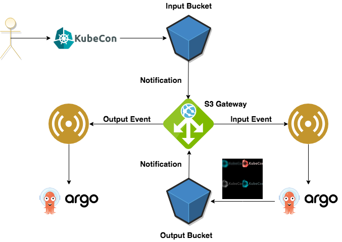
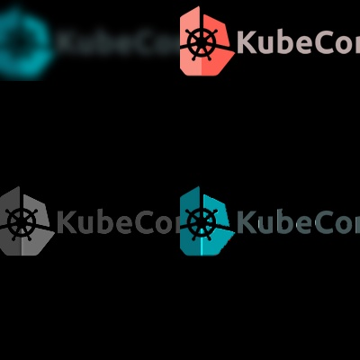

```bash
alias k="kubectl --namespace=argo-events"
```

```bash
curl https://dl.minio.io/client/mc/release/linux-amd64/mc -o mc
```

```bash
chmod +x mc
```

```bash
./mc config host add minio http://35.232.72.252:9000 myaccess mysecret
```

```bash
./mc cp kubelogo.png minio/input
```

## 0. Let's install Argo-Events
```bash
sh install.sh
```

## 1. 


<br/>

- Create an event source
    ```bash
    k create -f https://raw.githubusercontent.com/VaibhavPage/kubecon-demo/master/demo1/gateway/webhook-gateway.yaml
    ```
 
- Create gateway
    ```bash
    k apply -f https://raw.githubusercontent.com/VaibhavPage/kubecon-demo/master/demo1/gateway/webhook-gateway-configmap.yaml
    ```

- Create sensor
    ```bash
    k apply -f https://raw.githubusercontent.com/VaibhavPage/kubecon-demo/master/demo1/sensor/webhook-sensor.yaml
    ```
    
 - Post request
 ```bash
  curl -X POST --data '{"msg": "Hello KubeCon!!!"}' http://35.226.73.251:12000/hello
 ```   
 
 - Delete workflow
  ```bash
  k delete wf --all
  ```   

 ---
  
 - Update event sources
    ```bash
    k apply -f https://raw.githubusercontent.com/VaibhavPage/kubecon-demo/master/demo1/gateway/webhook-gateway-configmap-updated.yaml
    ```

 - Check whether new event source is correctly added,
   ```bash
    k get gateway webhook-gateway -o yaml
    ``` 

 - Update triggers in sensor
    ```bash
    k apply -f https://raw.githubusercontent.com/VaibhavPage/kubecon-demo/master/demo1/sensor/webhook-sensor-updated.yaml
    ```
    
 - Post request to `/hello`
 ```bash
 curl -X POST --data '{"msg": "Hello KubeCon!!!"}' http://35.226.73.251:12000/hello
 ```
 
 - Post request to `/echo`
 ```bash
 curl -X POST --data '{"msg": "echo KubeCon!!!"}' http://35.226.73.251:12000/echo
 ```
 
 - Clear gateways, sensors and workflows
 ```bash
 k delete gateways --all
 ```
 ```bash
 k delete sensors --all
 ```
 ```bash
 k delete wf --all
 ```

## 2.

 

 - Input image
 
    
 
 - Output image
 
    
  
 - Create event sources
 ```bash
  k apply -f https://raw.githubusercontent.com/VaibhavPage/kubecon-demo/master/demo2/gateway/s3-gateway-configmap.yaml
 ```
 
 - Create S3 gateway
 ```bash
 k apply -f https://raw.githubusercontent.com/VaibhavPage/kubecon-demo/master/demo2/gateway/s3-gateway.yaml
 ```
 
 - Check all event sources are running 
 ```bash
 k get gateways s3-gateway -o yaml
 ```
 
 - Create input sensor
 ```bash
 k apply -f https://raw.githubusercontent.com/VaibhavPage/kubecon-demo/master/demo2/sensor/s3-input-sensor.yaml
 ```
 
 - Create output sensor
 ```bash
 k apply -f https://raw.githubusercontent.com/VaibhavPage/kubecon-demo/master/demo2/sensor/s3-output-sensor.yaml
 ```

### Uninstall Argo-Events

sh uninstall.sh
